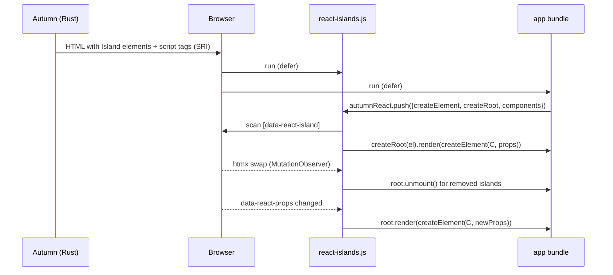

# ADR 0001: React islands through plugin asset bundles

- Status: accepted
- Date: 2026-10-05
- Applies to: autumn-plugin-react 0.1.0, autumn-web 0.8.0

## Context

Autumn renders HTML on the server with Maud and htmx. Some page parts need
rich client state. React components need a bundler (React 19 has no UMD
build). No Rust tool can render React. `autumn-web` 0.8.0 gives
`PluginAssets` and `AppBuilder::plugin_assets`. The API serves a plugin's
files under `/static/_plugins/<namespace>/` with hashed, `immutable` URLs,
`ETag`/`304`, `Range` and computed SRI hashes.

## Decision

1. The plugin ships one file, `react-islands.js` (the loader), as the
   `REACT_ASSETS` bundle (namespace `react`).
2. The app compiles its components with a bundler (esbuild or Vite). The
   entry file pushes `{ createElement, createRoot, flushSync, version,
   components }` on `window.autumnReact`. The app selects the React
   version (19 or later).
3. The app embeds the build output as its own `PluginAssets` bundle and
   gives it to `ReactPlugin::bundle`.
4. Rust renders each island with `Island`:

   ```html
   <div data-react-island="Counter" data-react-props='{"start":3}'
        data-react-mount="visible">fallback</div>
   ```

5. The loader mounts each island on the client with `createRoot` (no
   hydration). It moves the fallback nodes into memory before the first
   render. It puts them back after a render crash and at teardown.
6. One `MutationObserver` mounts added islands and unmounts removed islands.
   It watches `data-react-island`, `data-react-props`, `data-react-mount`
   (while the island waits) and `data-react-ignore`. A props change calls
   `root.render` on the same root, so React keeps the state.
7. Each root gets a unique `identifierPrefix` and an `onUncaughtError`
   handler.
8. Islands in a `[data-react-ignore]` element, or in another island, never
   mount.



## Consequences

- Good: no inline script, so the default CSP works.
- Good: the app selects the React version. Two bundles can use two
  versions.
- Good: no Node at run time. You deploy one binary.
- Good: the server can update props and React keeps the state.
- Bad: the server does not render the component. The fallback content is
  the first paint.
- Bad: user HTML can make islands. The sanitizer must remove
  `data-react-*`, `hx-*` and `data-hx-*`. `data-react-ignore` is a second
  guard only.
- Bad: React 18 is not supported. It has no `onUncaughtError`.
- Bad: the app needs Node to build its components.
- Bad: an idiomorph morph of an island's children fights React. Swap
  islands with `outerHTML`, or update them through `data-react-props`.
